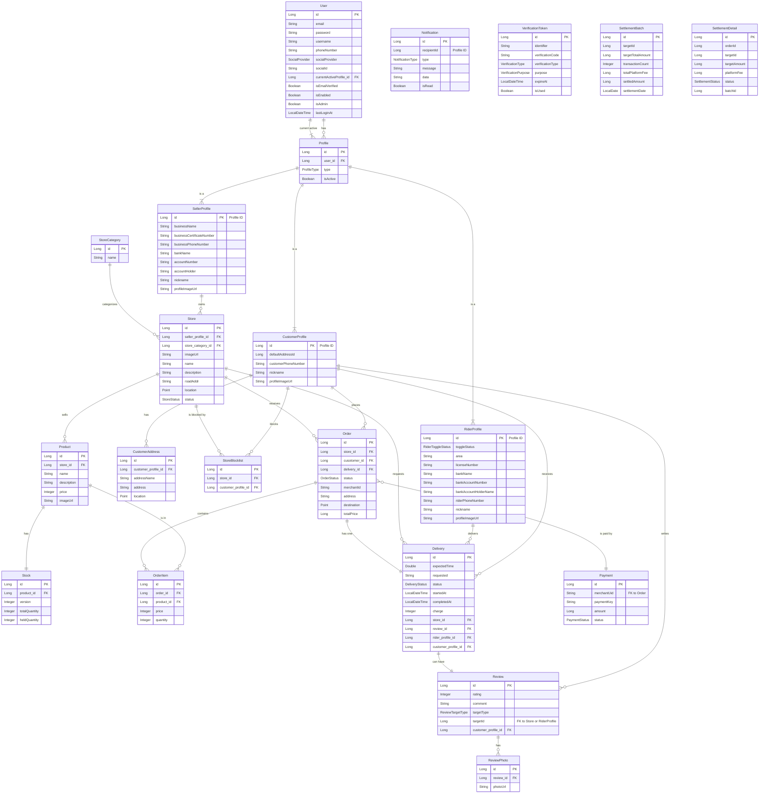

# Deliver Anything

프로그래머스 백엔드 데브코스 6기 4차 프로젝트

---

## 🌟 프로젝트 소개

`Deliver Anything`은 사용자의 위치를 기반으로 실시간 배달 서비스를 제공하는 플랫폼입니다.

- **고객(소비자)**: 주변 상점을 검색하고, 원하는 상품을 주문하며, 실시간으로 배달 상태를 추적할 수 있습니다.
- **점주(판매자)**: 자신의 상점과 상품을 등록하고, 들어온 주문을 관리하며, 정산 내역을 확인할 수 있습니다.
- **라이더(배달원)**: 배달 요청을 수락하고, 실시간 위치 정보를 공유하며, 배달 완료 후 정산받을 수 있습니다.

## 🛠️ 주요 기술 스택

- **Backend**: Java, Spring Boot, Spring Security, JPA
- **Database**: MySQL, Redis
- **Infra**: AWS (EC2, S3, RDS), Docker, Terraform
- **CI/CD**: GitHub Actions

```mermaid
graph TD
    A[Client App] --> B(API Gateway / Load Balancer)
    B --> C(Backend Application - Spring Boot)

    subgraph Backend Services
        direction LR
        C --> D(Auth)
        C --> E(User)
        C --> F(Store)
        C --> G(Product)
        C --> H(Order)
        C --> I(Payment)
        C --> J(Delivery)
        C --> K(Review)
        C --> L(Notification)
        C --> M(Search)
        C --> N(Settlement)
    end

    subgraph Data Stores
        direction LR
        C --> O[(MySQL)]
        C --> P[(Redis)]
        C --> Q[(Elasticsearch)]
    end

    subgraph External Integrations
        direction LR
        C --> R{{AWS S3}}
        C --> S{{SMS Gateway}}
        C --> T{{Payment Gateway}}
    end

    subgraph Infrastructure & CI/CD
        direction LR
        U[GitHub Actions] --> V[Docker]
        U --> W[Terraform]
        V --> Cloud[Cloud Environment]
        W --> Cloud
        Cloud --> C
    end

    %% --- Styles ---
    style A fill:#5DADE2,stroke:#1B4F72,stroke-width:2px,color:#fff
    style B fill:#3498DB,stroke:#1B4F72,stroke-width:2px,color:#fff
    style C fill:#2E86C1,stroke:#1B2631,stroke-width:2px,color:#fff

    %% Backend microservices
    style D fill:#A569BD,stroke:#4A235A,stroke-width:1.5px,color:#fff
    style E fill:#A569BD,stroke:#4A235A,stroke-width:1.5px,color:#fff
    style F fill:#48C9B0,stroke:#0E6251,stroke-width:1.5px,color:#fff
    style G fill:#48C9B0,stroke:#0E6251,stroke-width:1.5px,color:#fff
    style H fill:#45B39D,stroke:#0E6655,stroke-width:1.5px,color:#fff
    style I fill:#45B39D,stroke:#0E6655,stroke-width:1.5px,color:#fff
    style J fill:#52BE80,stroke:#145A32,stroke-width:1.5px,color:#fff
    style K fill:#52BE80,stroke:#145A32,stroke-width:1.5px,color:#fff
    style L fill:#58D68D,stroke:#1D8348,stroke-width:1.5px,color:#fff
    style M fill:#5DADE2,stroke:#1B4F72,stroke-width:1.5px,color:#fff
    style N fill:#5DADE2,stroke:#1B4F72,stroke-width:1.5px,color:#fff

    %% Data stores
    style O fill:#F5B041,stroke:#7E5109,stroke-width:2px,color:#000
    style P fill:#F8C471,stroke:#7E5109,stroke-width:2px,color:#000
    style Q fill:#FAD7A0,stroke:#7E5109,stroke-width:2px,color:#000

    %% External integrations
    style R fill:#82E0AA,stroke:#1E8449,stroke-width:2px,color:#000
    style S fill:#7DCEA0,stroke:#1E8449,stroke-width:2px,color:#000
    style T fill:#73C6B6,stroke:#117864,stroke-width:2px,color:#000

    %% Infra & CI/CD
    style U fill:#D2B4DE,stroke:#512E5F,stroke-width:2px,color:#000
    style V fill:#BB8FCE,stroke:#512E5F,stroke-width:2px,color:#000
    style W fill:#C39BD3,stroke:#512E5F,stroke-width:2px,color:#000
    style Cloud fill:#D5DBDB,stroke:#424949,stroke-width:2px,color:#000
```

<br>

<details>
<summary>🌐 시스템 구성도 (System Architecture Diagram)</summary>



### 🌐 시스템 구성도 상세 설명

`Deliver Anything` 프로젝트는 확장성과 안정성을 고려한 마이크로서비스 지향 아키텍처로 설계되었습니다. 주요 구성 요소는 다음과 같습니다.

1.  **클라이언트 (Client App)**
    *   사용자가 서비스를 이용하는 웹 또는 모바일 애플리케이션입니다.

2.  **API Gateway / Load Balancer**
    *   클라이언트의 모든 요청을 받아 백엔드 애플리케이션으로 라우팅하고 부하를 분산합니다. Nginx 또는 Nginx Proxy Manager가 이 역할을 수행할 수 있습니다.

3.  **백엔드 애플리케이션 (Backend Application - Spring Boot)**
    *   Java와 Spring Boot 프레임워크로 개발된 핵심 애플리케이션입니다.
    *   **모듈형 모놀리식(Modular Monolith)** 형태로, 각 도메인(`Auth`, `Order`, `Delivery` 등)이 명확하게 분리되어 있습니다.
    *   **Spring Security**를 통해 사용자 인증 및 권한 부여를 처리합니다.
    *   **WebSocket**을 사용하여 실시간 배달 현황 추적 등 양방향 통신을 지원합니다.
    *   **Springdoc OpenAPI**를 통해 API 문서를 자동 생성하고 관리합니다.

    *   **Backend Services (주요 도메인)**
        *   **Auth (인증)**: 사용자 로그인, 회원가입, 토큰 관리 등 인증/인가를 담당합니다.
        *   **User (사용자)**: 사용자 프로필, 주소지 관리 등 사용자 정보를 관리합니다.
        *   **Store (상점)**: 상점 정보 등록 및 관리, 카테고리 등을 담당합니다.
        *   **Product (상품)**: 상품 정보, 재고 관리 등을 담당합니다.
        *   **Order (주문)**: 주문 생성, 상태 변경 등 주문 라이프사이클을 관리합니다.
        *   **Payment (결제)**: 외부 결제 게이트웨이 연동을 통해 결제를 처리합니다.
        *   **Delivery (배달)**: 배달 요청, 라이더 매칭, 실시간 위치 추적 등 배달 과정을 관리합니다.
        *   **Review (리뷰)**: 상점 및 라이더에 대한 리뷰를 관리합니다.
        *   **Notification (알림)**: 사용자에게 푸시 알림, SMS 등을 발송합니다.
        *   **Search (검색)**: 상품, 상점 등 서비스 내 검색 기능을 제공합니다.
        *   **Settlement (정산)**: 상점 및 라이더에 대한 정산 로직을 처리합니다.

4.  **데이터 저장소 (Data Stores)**
    *   **MySQL Database**: 주요 비즈니스 데이터(사용자, 주문, 상품 정보 등)를 저장하는 관계형 데이터베이스입니다. **JPA**와 **Querydsl**을 활용하여 데이터 접근을 효율화합니다.
    *   **Redis**: 캐싱, 사용자 세션 관리, 실시간 데이터 처리(예: 배달 위치 정보), Pub/Sub 메시징 등 고성능 데이터 처리에 사용됩니다.
    *   **Elasticsearch**: `Search Service`를 위해 사용되며, 상품 및 상점 검색 등 복잡하고 빠른 전문 검색 기능을 제공합니다.

5.  **외부 연동 서비스 (External Integrations)**
    *   **AWS S3**: 이미지, 동영상 등 대용량 미디어 파일을 저장하고 관리하는 데 사용되는 클라우드 스토리지 서비스입니다.
    *   **SMS Gateway**: 사용자에게 인증 코드, 리뷰 알림 등 SMS를 발송하기 위한 외부 SMS 발송 서비스와 연동됩니다.
    *   **Payment Gateway**: 결제 처리를 위해 외부 결제 서비스 제공업체(PG사)와 연동됩니다.

6.  **인프라 및 CI/CD (Infrastructure & CI/CD)**
    *   **Docker**: 백엔드 애플리케이션을 컨테이너화하여 환경 독립적인 배포를 가능하게 합니다.
    *   **Terraform**: 클라우드 인프라(AWS EC2, RDS 등)를 코드로 정의하고 관리(Infrastructure as Code)하여 자동화된 프로비저닝 및 배포를 지원합니다.
    *   **GitHub Actions**: 코드 변경 시 자동으로 빌드, 테스트, 배포를 수행하는 CI/CD 파이프라인을 구축하여 개발 효율성을 높입니다. `main` 브랜치 푸시 시 Docker 이미지 빌드 및 GHCR 푸시, AWS EC2 Blue/Green 배포가 자동화됩니다.
</details>

<br>

<details>
<summary>📊 ERD (Entity-Relationship Diagram)</summary>



</details>

<br>

<details>
<summary>📄 API Specification</summary>

### Auth API
| Method | Endpoint | Description |
| :--- | :--- | :--- |
| `POST` | `/api/v1/auth/signup` | 회원가입 |
| `POST` | `/api/v1/auth/login` | 로그인 |
| `POST` | `/api/v1/auth/logout` | 단일 로그아웃 (현재 기기) |
| `POST` | `/api/v1/auth/logout/all` | 전체 로그아웃 (모든 기기) |
| `POST` | `/api/v1/auth/refresh` | 토큰 재발급 |

### Delivery API
| Method | Endpoint | Description |
| :--- | :--- | :--- |
| `PATCH` | `/api/v1/deliveries/status` | 라이더 토글 전환 |
| `POST` | `/api/v1/deliveries/area` | 배달 가능 지역 설정 |
| `PATCH` | `/api/v1/deliveries/{deliveryId}/delivery-status` | 배달 상태 변경 |
| `POST` | `/api/v1/deliveries/decision` | 라이더 배달 수락/거절 결정 |
| `GET` | `/api/v1/deliveries/today` | 오늘의 배달 내역 조회 |
| `GET` | `/api/v1/deliveries/in-progress` | 진행 중인 배달 조회 |
| `GET` | `/api/v1/deliveries/in-progress/{deliveryId}` | 진행 중인 배달 단건 상세 조회 |
| `GET` | `/api/v1/deliveries/total` | 총 배달 내역 요약 조회 + 배달 완료 리스트 조회 |

### Rider Location WebSocket API
| Type | Endpoint | Description |
| :--- | :--- | :--- |
| `@MessageMapping` | `/location` | 라이더 위치 정보 업데이트 (WebSocket) |

### Media API
| Method | Endpoint | Description |
| :--- | :--- | :--- |
| `POST` | `/api/v1/media/presigned-url` | 파일 업로드를 위한 Pre-signed URL 생성 |

### Notification API
| Method | Endpoint | Description |
| :--- | :--- | :--- |
| `GET` | `/api/v1/notifications/stream` | SSE 구독 |
| `GET` | `/api/v1/notifications` | 알림 목록 조회 |
| `POST` | `/api/v1/notifications/{id}/read` | 알림 읽음 처리 |
| `GET` | `/api/v1/notifications/unread-count` | 읽지 않은 알림 수 조회 |

### Customer Order API
| Method | Endpoint | Description |
| :--- | :--- | :--- |
| `POST` | `/api/v1/customer/orders` | 주문 생성 |
| `GET` | `/api/v1/customer/orders` | 주문 내역 조회 |
| `GET` | `/api/v1/customer/orders/{orderId}` | 주문 단일 조회 |
| `GET` | `/api/v1/customer/orders/in-progress` | 진행중인 주문 조회 |
| `GET` | `/api/v1/customer/orders/completed` | 배달 완료된 주문 조회 |
| `POST` | `/api/v1/customer/orders/{merchantUid}/pay` | 주문 결제 |
| `POST` | `/api/v1/customer/orders/{orderId}/cancel` | 주문 취소 |

### Store Order API
| Method | Endpoint | Description |
| :--- | :--- | :--- |
| `GET` | `/api/v1/stores/{storeId}/orders/history` | 주문 내역 조회 |
| `GET` | `/api/v1/stores/{storeId}/orders/pending` | 주문 수락 대기 목록 조회 |
| `GET` | `/api/v1/stores/{storeId}/orders/accepted` | 주문 현황 목록 조회 |
| `PATCH` | `/api/v1/stores/{storeId}/orders/{orderId}/accept` | 주문 수락 |
| `PATCH` | `/api/v1/stores/{storeId}/orders/{orderId}/reject` | 주문 거절 |

### Product API
| Method | Endpoint | Description |
| :--- | :--- | :--- |
| `POST` | `/api/v1/stores/{storeId}/products` | 상품 생성 |
| `GET` | `/api/v1/stores/{storeId}/products` | 상품 목록 조회 |
| `GET` | `/api/v1/stores/{storeId}/products/{productId}` | 상품 상세 조회 |
| `PUT` | `/api/v1/stores/{storeId}/products/{productId}` | 상품 정보 수정 |
| `DELETE` | `/api/v1/stores/{storeId}/products/{productId}` | 상품 삭제 |

### Review API
| Method | Endpoint | Description |
| :--- | :--- | :--- |
| `POST` | `/api/v1/reviews` | 리뷰 생성 |
| `DELETE` | `/api/v1/reviews/{reviewId}` | 리뷰 삭제 |
| `PATCH` | `/api/v1/reviews/{reviewId}` | 리뷰 수정 |
| `GET` | `/api/v1/reviews/{reviewId}` | 리뷰 조회 |
| `GET` | `/api/v1/me/reviews` | 내 리뷰 리스트 & 평점 조회 |
| `GET` | `/api/v1/stores/{storeId}/reviews` | 특정 상점 리뷰 리스트 & 평점 조회 |
| `POST` | `/api/v1/reviews/{reviewId}/like` | 리뷰 좋아요 등록 |
| `DELETE` | `/api/v1/reviews/{reviewId}/like` | 리뷰 좋아요 취소 |
| `GET` | `/api/v1/reviews/{reviewId}/likes` | 리뷰 좋아요 수 조회 |

### Store Search API
| Method | Endpoint | Description |
| :--- | :--- | :--- |
| `GET` | `/api/v1/search/stores` | 상점 검색 |

### Rider Settlement API
| Method | Endpoint | Description |
| :--- | :--- | :--- |
| `GET` | `/api/v1/rider/settlements/day` | 정산 일별 조회 |
| `GET` | `/api/v1/rider/settlements/week` | 정산 주간별 조회 |
| `GET` | `/api/v1/rider/settlements/month` | 정산 월별 조회 |
| `GET` | `/api/v1/rider/settlements/period` | 정산 기간 조회 |
| `GET` | `/api/v1/rider/settlements/summary` | 정산 요약 조회 |

### Store Settlement API
| Method | Endpoint | Description |
| :--- | :--- | :--- |
| `GET` | `/api/v1/store/settlements/{storeId}/day` | 정산 일별 조회 |
| `GET` | `/api/v1/store/settlements/{storeId}/week` | 정산 주간별 조회 |
| `GET` | `/api/v1/store/settlements/{storeId}/month` | 정산 월별 조회 |
| `GET` | `/api/v1/store/settlements/{storeId}/period` | 정산 기간 조회 |

### Store Category API
| Method | Endpoint | Description |
| :--- | :--- | :--- |
| `GET` | `/api/v1/store-categories` | 상점 카테고리 목록 조회 |

### Store API
| Method | Endpoint | Description |
| :--- | :--- | :--- |
| `POST` | `/api/v1/stores` | 상점 생성 |
| `GET` | `/api/v1/stores/{storeId}` | 상점 단건 조회 |
| `PUT` | `/api/v1/stores/{storeId}` | 상점 정보 수정 |
| `DELETE` | `/api/v1/stores/{storeId}` | 상점 삭제 |
| `POST` | `/api/v1/stores/{storeId}/toggle-status` | 상점 영업상태 변경 |

### Customer Profile API
| Method | Endpoint | Description |
| :--- | :--- | :--- |
| `GET` | `/api/v1/users/me/customer` | 내 고객 프로필 조회 |
| `PUT` | `/api/v1/users/me/customer` | 내 고객 프로필 수정 |
| `GET` | `/api/v1/users/me/customer/addresses` | 내 배송지 목록 조회 |
| `GET` | `/api/v1/users/me/customer/addresses/{addressId}` | 특정 배송지 조회 |
| `POST` | `/api/v1/users/me/customer/addresses` | 배송지 추가 |
| `PUT` | `/api/v1/users/me/customer/addresses/{addressId}` | 배송지 수정 |
| `DELETE` | `/api/v1/users/me/customer/addresses/{addressId}` | 배송지 삭제 |
| `PUT` | `/api/v1/users/me/customer/addresses/{addressId}/default` | 기본 배송지 설정 |
| `GET` | `/api/v1/users/me/customer/addresses/default` | 기본 배송지 조회 |

### Rider Profile API
| Method | Endpoint | Description |
| :--- | :--- | :--- |
| `GET` | `/api/v1/users/me/rider` | 내 배달원 프로필 조회 |
| `PUT` | `/api/v1/users/me/rider` | 내 배달원 프로필 수정 |
| `POST` | `/api/v1/users/me/rider/toggle` | 배달 상태 토글 |
| `PUT` | `/api/v1/users/me/rider/status` | 배달 상태 설정 |
| `GET` | `/api/v1/users/me/rider/available` | 배달 가능 여부 조회 |
| `PUT` | `/api/v1/users/me/rider/area` | 활동 지역 수정 |
| `GET` | `/api/v1/users/me/rider/area` | 활동 지역 조회 |
| `PUT` | `/api/v1/users/me/rider/account-info` | 정산 계좌 정보 수정 |

### Seller Profile API
| Method | Endpoint | Description |
| :--- | :--- | :--- |
| `GET` | `/api/v1/users/me/seller` | 내 판매자 프로필 조회 |
| `PUT` | `/api/v1/users/me/seller` | 내 판매자 프로필 수정 |
| `PUT` | `/api/v1/users/me/seller/business-info` | 사업자 정보 수정 |
| `PUT` | `/api/v1/users/me/seller/account-info` | 정산 계좌 정보 수정 |

### User API
| Method | Endpoint | Description |
| :--- | :--- | :--- |
| `GET` | `/api/v1/users/me` | 내 정보 조회 |
| `PUT` | `/api/v1/users/me` | 내 정보 수정 |
| `PUT` | `/api/v1/users/me/password` | 비밀번호 변경 |
| `POST` | `/api/v1/users/me/profiles` | 프로필 생성 |
| `POST` | `/api/v1/users/me/profile/switch` | 프로필 전환 |
| `GET` | `/api/v1/users/me/profiles` | 사용 가능한 프로필 목록 조회 |

</details>

<br>

<details>
<summary>✅ Workflow Guide</summary>

## 1. Issue → Branch
- **이슈는 반드시 GitHub Project 보드에서 생성**
  - Projects → Buddy App → **New issue** 버튼 클릭
  - 이슈 템플릿(`Type`, `Scope`, `Summary`, `Details`)에 맞춰 작성
- 규칙에 맞는 이슈만 자동 브랜치 생성됨
- 브랜치 네이밍 규칙:
  ```
  {type}/{scope}/{issue_number}
  ```
  예) `feat/be/12`

### Type
- `feat` : 새로운 기능
- `fix` : 버그 수정
- `refactor` : 리팩터링
- `docs` : 문서 작업
- `chore` : 환경/설정/잡일
- `test` : 테스트 코드

### Scope
- `fe` : Frontend
- `be` : Backend
- `infra` : Infra / 배포 / 환경

---

## 2. Pull Request
- 브랜치 작업 완료 후 → **PR 생성**
- **PR 제목 자동 동기화**: 이슈 제목 + 번호  
  예)  
  ```
  feat(be): 로그인 API 추가 (#12)
  ```

### PR 병합 규칙
- `dev` 브랜치로 머지:  
  - 관련 이슈 자동 close  
  - 작업 브랜치 자동 삭제
- `main` 브랜치로 머지:  
  - 배포 파이프라인(CD) 실행

---

## 3. Branch Strategy
- `main` : 배포용 브랜치 (Release 태그, Docker 빌드/푸시, 배포 실행)  
- `dev` : 통합 개발 브랜치 (이슈별 브랜치가 합쳐지는 곳)  
- `feat/*`, `fix/*`, `refactor/*`, `docs/*`, `chore/*`, `test/*` :  
  → 이슈 단위 작업 브랜치 (머지 후 자동 삭제)

---

## 4. CI/CD
### CI (Backend CI)
- **트리거**: `dev`, `main` 브랜치에서 push & PR  
- **동작**:
  - Gradle 빌드 & 테스트 실행
  - Redis 컨테이너 서비스 지원
  - `.env` 파일 GitHub Secrets 기반 로드

### CD (Backend CD)
- **트리거**: `main` 브랜치 push  
- **동작**:
  - Git Tag + Release 생성
  - Docker 이미지 빌드 & GHCR Push
  - AWS EC2 Blue/Green 배포 (SSM SendCommand 이용)

---

## 5. Issue Template
- 하나의 공통 템플릿 제공
  - **Type** : feat / fix / refactor / docs / chore / test  
  - **Scope** : fe / be / infra  
  - **Summary** : 간단 요약 (브랜치명/PR 제목 반영)  
  - **Details** : 작업 설명 & 완료 기준

---

## ✅ Workflow 요약
1. **Issue 생성 (Projects 보드에서만)**  
2. 규칙에 맞으면 **브랜치 자동 생성**  
3. 작업 후 **PR 생성 → PR 제목 자동 동기화**  
4. **PR 병합**
   - `dev`: 이슈 닫기 + 브랜치 삭제  
   - `main`: CD 실행 (배포)  
5. **Release & 배포** → Docker + AWS EC2 Blue/Green

</details>
